<p align="center">

<strong>Student Registration System</strong>

</p>

<p align="center">

Laravel • MySQL • Blade • Eloquent ORM

</p>

---

# Student Registration System

A Laravel-based Student Registration System developed for **ITST 302 – Client-Server Technologies – Week 4 Laboratory Activity**.

The system allows students to register their personal, contact, and academic information through an online registration form. The application validates the submitted information, stores student records in a MySQL database, supports profile picture uploads, displays validation errors, provides success messages, and displays the registered student's profile.

---

# 1. Introduction

The **Student Registration System** is a web application developed using the Laravel framework and MySQL database.

The main purpose of the system is to provide a simple and organized digital registration process for students. Instead of collecting student information manually, the system allows users to submit their information through an online form.

The application demonstrates several important Laravel concepts, including:

* Laravel routing
* Controllers
* Blade templates
* Server-side validation
* Eloquent ORM
* Database migrations
* MySQL database integration
* File uploads
* Laravel Storage
* Flash messages
* Request handling
* Git and GitHub

---

# 2. Objectives

The objectives of this project are:

* To develop a functional Student Registration System using Laravel.
* To create a user-friendly student registration form.
* To implement server-side validation.
* To prevent invalid or incomplete student information.
* To prevent duplicate Student IDs.
* To prevent duplicate email addresses.
* To allow profile picture uploads.
* To store student information in a MySQL database.
* To use Laravel migrations to create the database structure.
* To use Eloquent ORM for database operations.
* To display validation errors to users.
* To display a success message after registration.
* To understand the Laravel request lifecycle.
* To practice Git and GitHub version control.
* To document the complete development process.

---

# 3. Technologies Used

| Technology      | Purpose                           |
| --------------- | --------------------------------- |
| Laravel         | Backend web application framework |
| PHP             | Programming language              |
| MySQL           | Database management system        |
| Blade           | Laravel templating engine         |
| Eloquent ORM    | Database interaction              |
| HTML            | Page structure                    |
| CSS             | Page styling                      |
| Laravel Storage | Profile picture storage           |
| Git             | Version control                   |
| GitHub          | Source code repository            |
| VS Code         | Code editor                       |

---

# 4. Laravel Request Lifecycle

The Student Registration System follows the Laravel request lifecycle when a student submits the registration form.

### Request Lifecycle Diagram

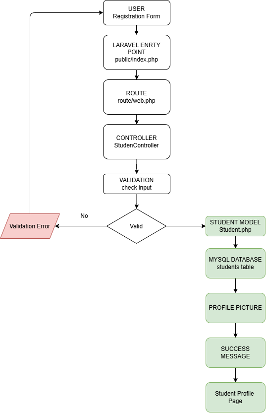

---

# 5. Validation Rules

The application uses server-side validation to ensure that student information is valid before it is stored in the database.

| Field           | Validation                         |
| --------------- | ---------------------------------- |
| Student ID      | Required and unique                |
| First Name      | Required                           |
| Middle Name     | Optional                           |
| Last Name       | Required                           |
| Email           | Required, valid email, and unique  |
| Mobile Number   | Required                           |
| Date of Birth   | Required and valid date            |
| Gender          | Required                           |
| Program         | Required                           |
| Year Level      | Required                           |
| Address         | Required                           |
| Profile Picture | Optional and validated as an image |

### Why Validation Is Important

Validation helps prevent incomplete and invalid information from being stored in the database.

The system checks important information before registration is completed. Unique validation is also used for the Student ID and email address to prevent duplicate records.

---

# 6. Database Design

The Student Registration System uses a MySQL database to store student registration information. The main table used by the system is the `students` table.

The database structure was created using a Laravel migration. The table contains student personal information, contact information, academic information, and the profile picture path.

## 6.1 Entity Relationship Diagram (ERD)

The Student Registration System currently uses one main entity, the `students` table.

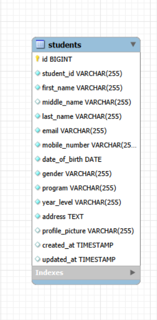

### ERD Description

The `students` table contains all information required for a student registration record. Each student has a unique `id` as the primary key. The `student_id` and `email` fields are also unique to prevent duplicate student registrations.

---

## 6.2 Students Table Structure

| Column            | Data Type    | Key         | Constraints      | Description                          |
| ----------------- | ------------ | ----------- | ---------------- | ------------------------------------ |
| `id`              | BIGINT       | Primary Key | Auto Increment   | Unique database identifier           |
| `student_id`      | VARCHAR(255) | Unique      | Required, Unique | Student identification number        |
| `first_name`      | VARCHAR(255) | —           | Required         | Student's first name                 |
| `middle_name`     | VARCHAR(255) | —           | Nullable         | Student's middle name                |
| `last_name`       | VARCHAR(255) | —           | Required         | Student's last name                  |
| `email`           | VARCHAR(255) | Unique      | Required, Unique | Student's email address              |
| `mobile_number`   | VARCHAR(255) | —           | Required         | Student's mobile number              |
| `date_of_birth`   | DATE         | —           | Required         | Student's date of birth              |
| `gender`          | VARCHAR(255) | —           | Required         | Student's gender                     |
| `program`         | VARCHAR(255) | —           | Required         | Student's academic program           |
| `year_level`      | VARCHAR(255) | —           | Required         | Student's year level                 |
| `address`         | TEXT         | —           | Required         | Student's address                    |
| `profile_picture` | VARCHAR(255) | —           | Nullable         | Path of uploaded profile picture     |
| `created_at`      | TIMESTAMP    | —           | Nullable         | Date and time the record was created |
| `updated_at`      | TIMESTAMP    | —           | Nullable         | Date and time the record was updated |

---

## 6.3 Data Types

The Laravel migration defines the following data types:

* `id` uses Laravel's `$table->id()` and serves as the BIGINT primary key.
* `student_id` uses `string`, which creates a VARCHAR column.
* `first_name` uses `string`, which creates a VARCHAR column.
* `middle_name` uses `string` and is nullable.
* `last_name` uses `string`, which creates a VARCHAR column.
* `email` uses `string`, which creates a VARCHAR column.
* `mobile_number` uses `string`, which creates a VARCHAR column.
* `date_of_birth` uses `date`, which creates a DATE column.
* `gender` uses `string`, which creates a VARCHAR column.
* `program` uses `string`, which creates a VARCHAR column.
* `year_level` uses `string`, which creates a VARCHAR column.
* `address` uses `text`, which creates a TEXT column.
* `profile_picture` uses `string` and is nullable.
* `created_at` and `updated_at` are created automatically using Laravel's `$table->timestamps()`.

---

## 6.4 Primary Key

The primary key of the `students` table is:

```text
id
```

It is created using:

```php
$table->id();
```

The primary key uniquely identifies each student record in the database.

---

## 6.5 Constraints

The database uses several constraints to maintain data integrity.

### Unique Student ID

```php
$table->string('student_id')->unique();
```

The `student_id` field must be unique. This prevents multiple student records from having the same Student ID.

### Unique Email

```php
$table->string('email')->unique();
```

The `email` field must also be unique. This prevents the same email address from being registered multiple times.

### Nullable Middle Name

```php
$table->string('middle_name')->nullable();
```

The middle name is optional, so the database allows this field to contain a NULL value.

### Nullable Profile Picture

```php
$table->string('profile_picture')->nullable();
```

The profile picture path can be NULL when a profile picture has not been stored.

### Required Fields

The following fields are not marked as nullable in the migration and therefore are required at the database level:

* `student_id`
* `first_name`
* `last_name`
* `email`
* `mobile_number`
* `date_of_birth`
* `gender`
* `program`
* `year_level`
* `address`

---

## 6.6 Laravel Migration

The `students` table is created using the following Laravel migration:

```php
Schema::create('students', function (Blueprint $table) {
    $table->id();
    $table->string('student_id')->unique();
    $table->string('first_name');
    $table->string('middle_name')->nullable();
    $table->string('last_name');
    $table->string('email')->unique();
    $table->string('mobile_number');
    $table->date('date_of_birth');
    $table->string('gender');
    $table->string('program');
    $table->string('year_level');
    $table->text('address');
    $table->string('profile_picture')->nullable();
    $table->timestamps();
});
```

This migration allows the database structure to be created consistently using Laravel Artisan.

---

## 6.7 Database Screenshot

The following screenshot shows the registered student record stored in the MySQL `students` table.

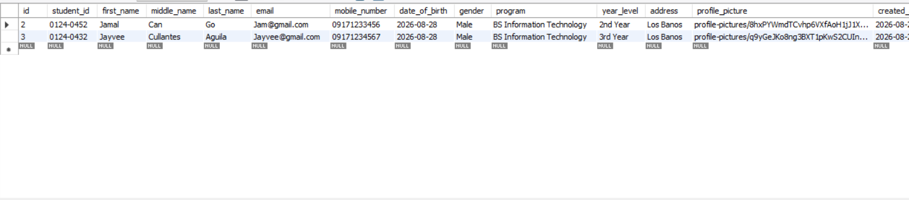

---

# 7. Registration Flowchart

The registration process follows this workflow:

### Registration Flowchart Diagram

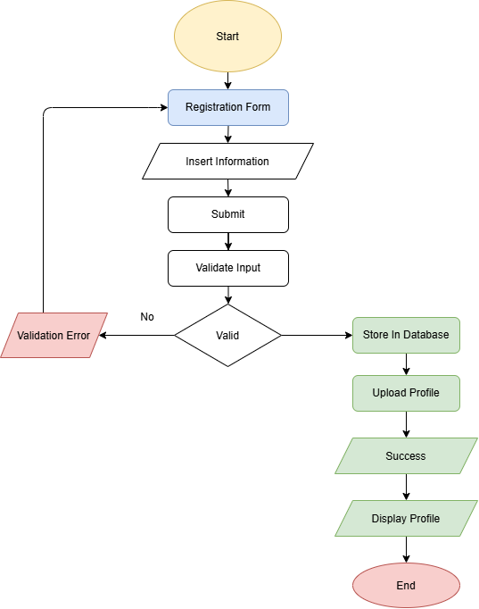

---

# 8. Screenshots

The following screenshots document the main features and development process of the Student Registration System.

## 8.1 Registration Form

The registration form allows the user to enter the student's personal, contact, and academic information.

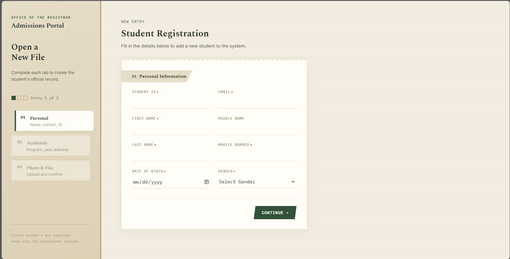

---

## 8.2 Validation Errors

This screenshot shows the validation errors displayed when required or invalid information is submitted.

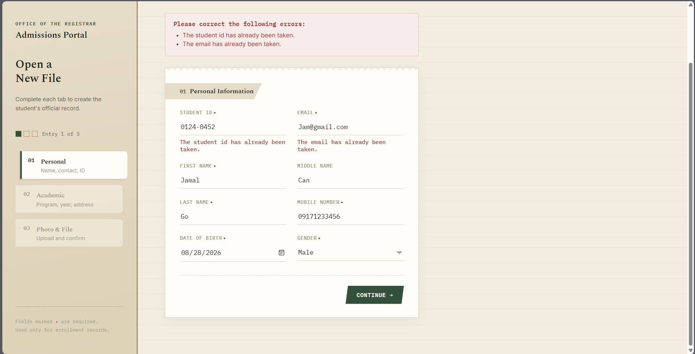

---

## 8.3 Flash Success Message

This screenshot shows the success message displayed after successfully registering a student.

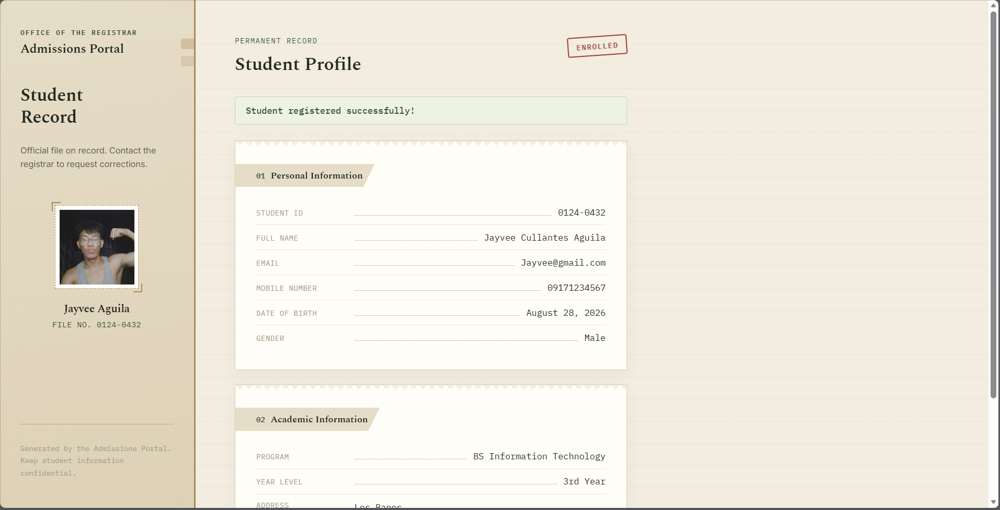

---

## 8.4 Uploaded Profile Picture

This screenshot demonstrates the profile picture upload functionality.

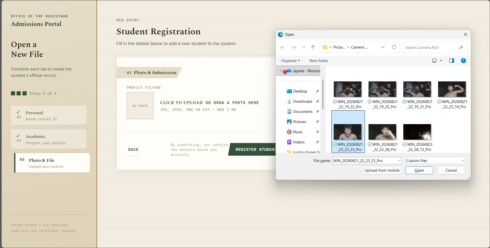

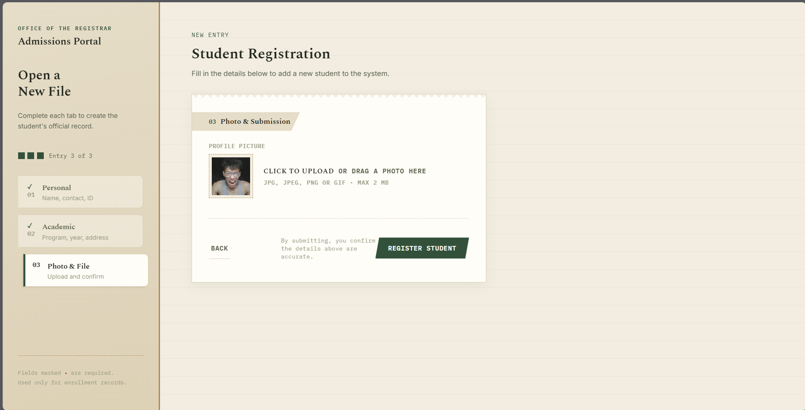

---

## 8.5 Student Profile

This screenshot shows the registered student's profile and information.

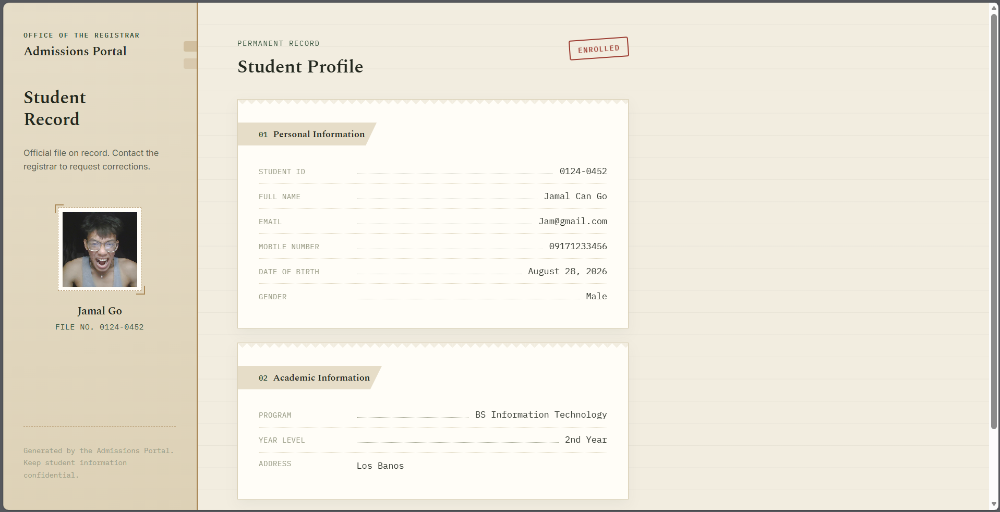

---

## 8.6 Database Records

This screenshot shows the registered student record stored in the MySQL `students` table.


---

## 8.7 Laravel Project Structure

This screenshot shows the Laravel project structure, including the main application folders and files.

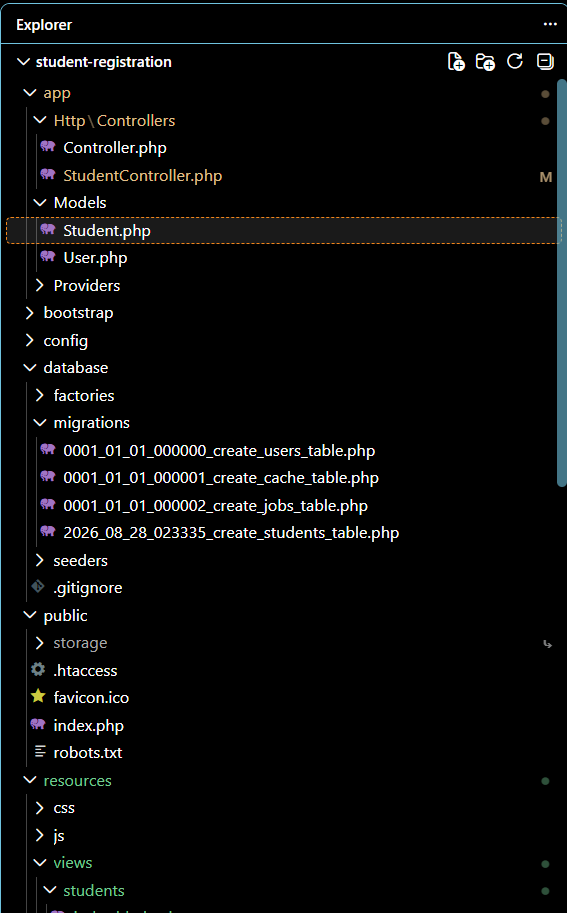

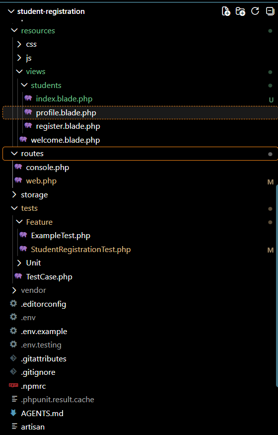


---

## 8.8 GitHub Repository

This screenshot shows the Student Registration System repository on GitHub.

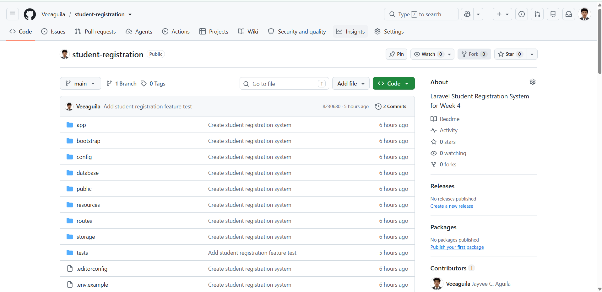

---

## 8.9 Terminal Output

This screenshot shows the Laravel Artisan commands and successful terminal output used during development and testing.

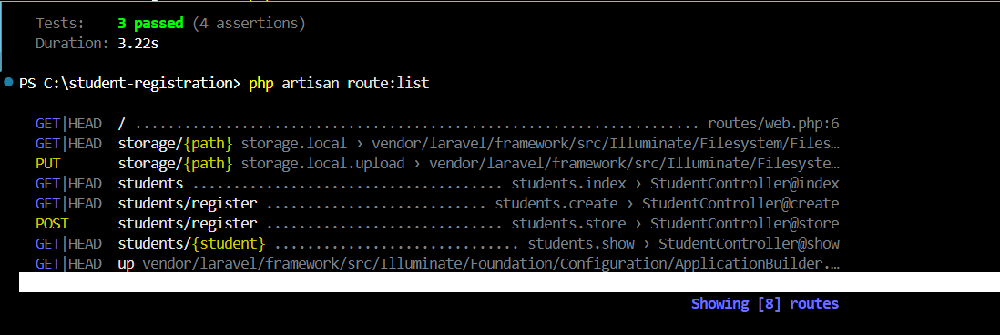

---

## 8.10 Browser Output

This screenshot shows the completed Student Registration System running in the browser.


---

# 9. Problems Encountered

## 9.1 Database Setup

One challenge encountered during development was creating the required `students` database table and connecting the Laravel application to MySQL.

## 9.2 Validation

Another challenge was implementing validation rules and ensuring that validation errors were displayed correctly when invalid information was submitted.

## 9.3 Profile Picture Upload

Handling the profile picture required configuring the form for file uploads, validating the uploaded image, and storing the file correctly.

## 9.4 Success Message

The application also needed to provide clear feedback to the user after successful registration.

---

# 10. Solutions

## 10.1 Database Setup

A Laravel migration was created to define the `students` table and its required fields. The migration was then executed using Laravel Artisan.

## 10.2 Validation

Laravel server-side validation was implemented to check the submitted student information before saving it to the database.

## 10.3 Profile Picture Upload

Laravel Storage was used to handle the uploaded profile picture. The file path is stored in the database so the image can be displayed later.

## 10.4 Success Message

A Laravel flash success message was implemented to inform the user when the student registration was completed successfully.

---

# 11. Reflection

Developing the Student Registration System helped me understand how the different components of a Laravel application work together. At first, a registration form may appear to be a simple interface for collecting information, but developing the complete system showed me that there are many processes involved in handling user input correctly.

One of the most important lessons I learned was the importance of server-side validation. User input should not automatically be trusted because users can submit incomplete or incorrect information. Laravel validation allows the application to check the submitted data before it is stored in the database. In this project, validation was used for required fields, unique Student IDs, unique email addresses, and other student information.

I also gained a better understanding of the Laravel request lifecycle. When a student submits the registration form, the request is received by Laravel and passed to the appropriate route. The controller processes the request and validates the submitted information. If the information is valid, the Student model is used to save the record to the MySQL database. Laravel then returns a response to the browser. Understanding this process helped me understand the relationship between routes, controllers, models, views, and databases.

Another important lesson was handling profile picture uploads. File uploads are different from normal text input because the application must process and store the uploaded file correctly. The profile picture is stored using Laravel Storage while the file path is saved in the database. This showed me why file handling must be carefully implemented in web applications.

The database portion of the activity also improved my understanding of Laravel migrations. Instead of manually creating the database structure, a migration can define the table and its columns using PHP code. The migration for this project creates the `students` table and includes unique constraints for the Student ID and email address.

Testing the application was another important part of the project. I tested the registration form, validation errors, successful registration, profile picture upload, student profile, database records, terminal commands, and browser output. These tests helped verify that the major features of the application were working correctly.

Overall, this activity provided me with practical experience in Laravel development. I learned that creating a functional web application involves more than designing the user interface. Proper validation, database design, request handling, file management, testing, and documentation are all important parts of development. The knowledge and experience I gained from this project will help me in developing larger client-server applications and future Laravel projects.

---

# 12. References

* Laravel. (n.d.). *Laravel documentation*. https://laravel.com/docs

* PHP Documentation Group. (n.d.). *PHP manual*. https://www.php.net/docs.php

* Oracle. (n.d.). *MySQL documentation*. https://dev.mysql.com/doc/

* MDN Web Docs. (n.d.). *MDN Web Docs*. https://developer.mozilla.org/